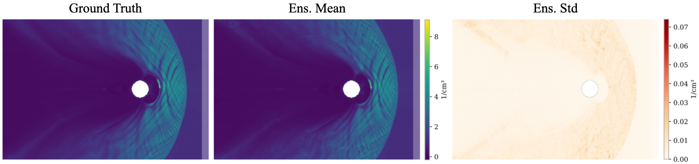

# SpaceCast

[](https://arxiv.org/abs/2509.19605) [](https://github.com/fmihpc/spacecast/actions/workflows/pre-commit.yml)



SpaceCast is a repository for graph-based neural space weather forecasting. The code uses [PyTorch Lightning](https://lightning.ai/pytorch-lightning/) for modeling, and [Weights & Biases](https://wandb.ai/) for logging. The code is based on [Neural-LAM](https://github.com/mllam/neural-lam) and uses [MDP](https://github.com/mllam/mllam-data-prep) for data prep, which lowers the bar to adapt progress in limited area modeling for space weather.

The repository contains LAM versions of:

* The graph-based model from [Keisler (2022)](https://arxiv.org/abs/2202.07575).
* GraphCast, by [Lam et al. (2023)](https://arxiv.org/abs/2212.12794).
* The hierarchical model from [Oskarsson et al. (2024)](https://arxiv.org/abs/2406.04759).

## Dependencies

Use Python 3.10 / 3.11 and

- `torch==2.5.1`
- `pytorch-lightning==2.4.0`
- `torch_geometric==2.6.1`
- `mllam-data-prep==0.6.1`

Complete list of packages can be installed with `pip install -r requirements.txt`.

## Data

The data is stored in `Zarr` format on [Zenodo](https://zenodo.org/records/16930055). To create a training-ready dataset with [mllam-data-prep](https://github.com/mllam/mllam-data-prep), run:
```
mllam_data_prep data/vlasiator_mdp.yaml
```

Simple, multiscale, and hierarchical graphs are created and stored in `.pt` format using the following commands:
```
python -m neural_lam.create_graph --config_path data/vlasiator_config.yaml --name simple --levels 1 --plot
python -m neural_lam.create_graph --config_path data/vlasiator_config.yaml --name multiscale --levels 3 --plot
python -m neural_lam.create_graph --config_path data/vlasiator_config.yaml --name hierarchical --hierarchical --levels 3 --plot
```

To plot the graphs and store as `.html` files run:
```
python -m neural_lam.plot_graph --datastore_config_path data/vlasiator_config.yaml --graph ...
```
with `--graph` as `simple`, `multiscale` or `hierarchcial` and `--save` is the name of the output file.

## Logging

If you'd like to login and use [W&B](https://wandb.ai/), run:
```
wandb login
```
If you prefer to just log things locally, run:
```
wandb off
```
See [docs](https://docs.wandb.ai/) for more details.

## Training

The first stage of a probabilistic model can be trained something like this (where in later stages you add `kl_beta` and `crps_weight`):

```
python -m neural_lam.train_model \
    --config_path data/vlasiator_config.yaml \
    --num_workers 2 \
    --precision bf16-mixed \
    --model graph_efm \
    --graph multiscale \
    --hidden_dim 64 \
    --processor_layers 4 \
    --ensemble_size 5 \
    --batch_size 1 \
    --lr 0.001 \
    --kl_beta 0 \
    --crps_weight 0 \
    --ar_steps_train 1 \
    --epochs 500 \
    --val_interval 50 \
    --ar_steps_eval 4 \
    --val_steps_to_log 1 2 3
```

Distributed data parallel training is supported. Specify number of nodes with the `--node` argument. For a full list of training options see `python neural_lam.train_model --help`.

## Evaluation

Inference uses the same script as training, with the same choice of parameters, and some to have an extra look at like `--eval test`, `--ar_steps_eval 30` and `--n_example_pred 1` to evaluate 30 second forecasts on the test set with 1 example forecast plotted.

```
python -m neural_lam.train_model \
  --config_path data/vlasiator_config.yaml \
  --model graph_efm \
  --graph hierarchical \
  --num_nodes 1 \
  --num_workers 2 \
  --batch_size 1 \
  --hidden_dim 64 \
  --processor_layers 2 \
  --ensemble_size 5 \
  --ar_steps_eval 30 \
  --precision bf16-mixed \
  --n_example_pred 1 \
  --eval test \
  --load ckpt_path
```
where a model checkpoint from a given path given to the `--load` in `.ckpt` format. Already trained model weights are available on [Zenodo](https://zenodo.org/records/16930055).

## Cite

```
@inproceedings{holmberg2025graph,
    title={Graph-based Neural Space Weather Forecasting},
    author={Holmberg, Daniel and Zaitsev, Ivan and Alho, Markku and Bouri, Ioanna and Franssila, Fanni and Jeong, Haewon and Palmroth, Minna and Roos, Teemu},
    booktitle={NeurIPS 2025 Workshop on Machine Learning and the Physical Sciences},
    year={2024}
}
```
